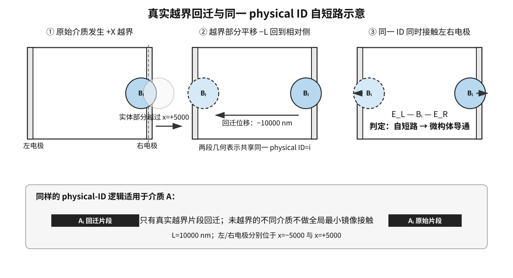
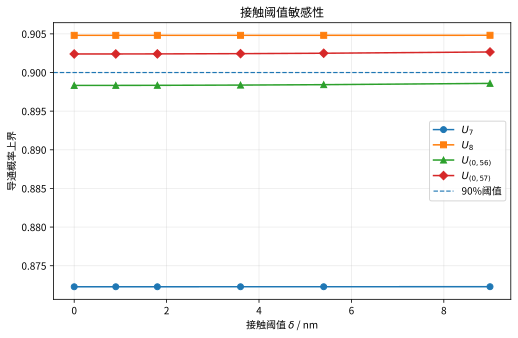
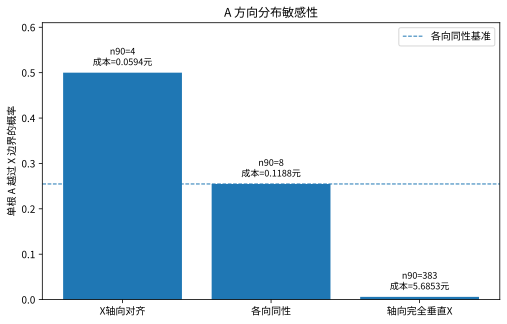
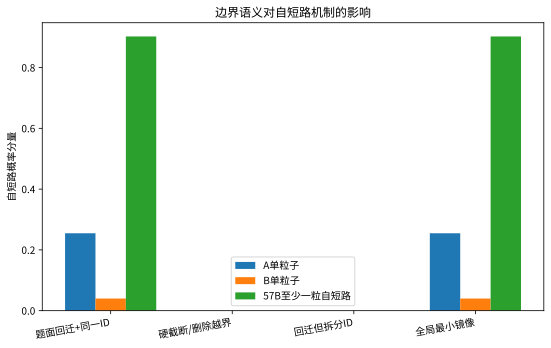

# 第7题教师意见修订稿

> 说明：本稿按老师提出的四项修改意见组织，可直接并入第7题论文的“模型假设、问题3、问题4、结果分析”部分。数值来自 `q7_Q4_stage3-5_evidence.zip` 中的阶段3—5解析证明与独立复核文件；题目原文来自 `2026年武汉理工大学数学建模训练题目7-9.docx`，附件坐标来自 `附件.xlsx`。

## 一、对老师意见的客观分析

四条意见都具有实质性合理性，而且分别对应论文中容易被评阅人追问的四个缺口：

1. **补自短路示意图是必要的。** 题面中的“边界截断”并不是把越界部分删除，而是将其沿越界方向平移一个微构体边长后重新放回；原像和回迁像属于同一个物理介质 ID。若缺少图示，读者容易把“同一根介质接触两极”误读为“两个介质通过网络连接”。新增图把“越界 → 回迁 → 同一 ID 接触两极”分成三个步骤，能直接支撑自短路事件的定义。
2. **Q3 的 7/8 根上下界表是必要的。** 只报告“最少为8根”而不展示相邻整数的证据，无法看出 7 根为何排除、8 根为何接受。用同一解析口径给出下界和上界，能形成严格的夹逼：7 根的上界仍低于 0.90，8 根的下界已经高于 0.90。
3. **Q4 的单位成本效率表是必要的。** Q4 的目标是总成本，不是介质根数。A 的单根自短路概率较高，但单位成本也高；B 的单根概率较低，却具有更高的“每元自短路概率”。把两者放在同一张表中，可以解释为什么最终最优解是纯 B 而不是纯 A 或混合方案。
4. **正面讨论边界口径是必要的。** 回迁规则直接改变粒子的拓扑关系和自短路概率，属于模型定义而非编程细节。论文应明确说明采用题面字面规则的原因、实现方式、未采用的替代口径及其影响，这比只给出一个程序结果更可复核。

因此，老师的意见不是单纯的排版要求，而是在补齐“机制可视化—临界证明—经济解释—口径可复核性”这条证据链。下面给出可直接替换或新增的论文内容。

## 二、新增图：自短路示意图

**图注：** 微构体为周期边界盒 $D=[-5000,5000]^3$ nm。导电介质越过某一面后，越界片段沿该方向平移一个边长 $L=10000$ nm 回到相对侧；若多方向越界，则逐方向重复。所有回迁片段保留同一 physical ID，因此原像与回迁像分别接触左、右带电面时，该根介质自身构成跨极通路，判定为自短路。

在程序实现中，回迁只改变几何位置，不复制物理对象；判定自短路时先按 ID 汇总其全部原像/回迁像，再检查该 ID 是否同时接触两侧电极。这样可以避免把一次自短路错误计成两个独立粒子之间的网络导通。

## 三、Q3：7 根与 8 根的解析上下界对比

### 3.1 解析口径

对介质 A，长度 $l_A=5000$ nm、半径 $r_A=30$ nm，微构体边长 $L=10000$ nm。严格平端圆柱在 $X$ 方向直接越界的概率为

\[
p_A^{D}=\frac{l_A}{2L}+\frac{\pi r_A}{2L}
=0.254712388980.
\]

令 $\delta=1.8$ nm，指定一侧电极的非越界接触壳层概率为

\[
p_E=\frac{\delta}{L}=0.00018.
\]

对 $n$ 根 A，至少一根直接越界自短路给出概率下界

\[
L_n=1-(1-p_A^{D})^n.
\]

若不存在直接越界自短路，则任何左右贯通路径至少需要“有粒子接触左电极”和“有粒子接触右电极”。由此得到必要事件概率上界

\[
U_n=1-2(1-p_A^{D}-p_E)^n+(1-p_A^{D}-2p_E)^n.
\]

这里 $L_n$ 是可行性证明使用的下界，$U_n$ 是不可行性证明使用的上界；二者不是同一个 Monte Carlo 估计量。

### 3.2 7/8 根对比表

| A 根数 $n$ | 体积分数（精确值） | 直接越界下界 $L_n$ | 必要事件上界 $U_n$ | 与 0.90 的关系 | 结论 |
|---:|---:|---:|---:|---|---|
| 7 | 0.0098960169% | 0.8722775285 | 0.8722778410 | $U_7<0.90$ | 7 根必不可行 |
| 8 | 0.0113097336% | 0.9048100243 | 0.9048103348 | $L_8>0.90$ | 8 根已可行 |

因此，7 根无法达到 90% 导通概率，而 8 根仅凭“至少一根 A 直接跨 X 自短路”这一必要子事件就已经达到 90% 以上。Q3 的最小填充量为 **8 根 A**，对应体积分数为 $0.0113097336$%，按题面要求保留到百分号后两位可报告为 **0.01%**（计算过程保留未四舍五入值）。

## 四、Q4：单位成本自短路效率对比

### 4.1 单粒子参数

介质体积以 $\mu m^3$ 计。A 的单根体积为 $0.01413716694\ \mu m^3$，单根成本为

\[
c_A=1.05V_A=0.01484402529\text{ 元};
\]

B 的单个体积为 $0.03351032164\ \mu m^3$，单个成本为

\[
c_B=0.05V_B=0.00167551608\text{ 元}.
\]

B 球的直接跨 $X$ 边界概率为 $p_B^D=2r_B/L=0.04$。

### 4.2 效率表

下表同时给出“单粒子每元效率”和“达到 90% 自短路下界时的方案效率”。前者解释材料的单位经济性，后者对应 Q3/Q4 的实际候选方案。

| 介质 | 单粒子直接自短路概率 | 单粒子成本/元 | 单粒子单位成本效率 (p^D/c)（每元） | 达到 90% 下界的最少根数 | 该方案自短路下界 | 该方案成本/元 | 方案单位成本效率 (L/c)（每元） |
|---|---:|---:|---:|---:|---:|---:|---:|
| A 圆柱 | 0.2547123890 | 0.0148440253 | 17.1593 | 8 | 0.9048100243 | 0.1187522023 | 7.6193 |
| B 球 | 0.0400000000 | 0.0016755161 | 23.8732 | 57 | 0.9023976480 | 0.0955044167 | 9.4488 |

结论是：A 的单粒子自短路概率约为 B 的 6.37 倍，但单根成本约为 B 的 8.86 倍，因此按单位成本计，B 的单粒子效率约为 A 的 **1.39 倍**；在各自达到 90% 下界的临界方案上，B 的单位成本效率约为 A 的 **1.24 倍**。这给出 Q4 最优解偏向 B 的经济解释，但不能单独替代全局最优证明。

### 4.3 Q4 全局最优结果（保留原证明）

纯 A 的解析最小可行方案为 $(N_A,N_B)=(8,0)$，成本 $0.1187522023$ 元；纯 B 的解析最小可行方案为 $(0,57)$，成本 $0.0955044167$ 元，因此以 $(0,57)$ 作为成本上界。

所有严格低于该上界的整数方案均满足 $N_A\le 6$。固定 $N_A$ 时导通概率随 $N_B$ 单调不减，所以只需检查每个成本层的最大 $N_B$ 前沿点：

| $N_A$ | 更便宜时最大 $N_B$ | 成本/元 | 自短路下界 | 总导通必要事件上界 |
---:|---:|---:|---:|---:|
| 0 | 56 | 0.093828901 | 0.898330883 | 0.898341781 |
| 1 | 48 | 0.095268797 | 0.894962812 | 0.894971522 |
| 2 | 39 | 0.095033178 | 0.886961628 | 0.886968280 |
| 3 | 30 | 0.094797558 | 0.878350957 | 0.878355684 |
| 4 | 21 | 0.094561939 | 0.869084369 | 0.869087377 |
| 5 | 12 | 0.094326319 | 0.859111902 | 0.859113481 |
| 6 | 3 | 0.094090700 | 0.848379784 | 0.848380328 |

七个前沿点的必要事件上界均小于 0.90；对全部 216 个更便宜整数点的独立枚举也得到相同结论。因此

\[
\boxed{(N_A^*,N_B^*)=(0,57)},\qquad
\boxed{C_{\min}=0.0955044167\text{ 元}}.
\]

最优方案的 B 体积分数为 $0.1910088333\%$。

阶段5采用完整 B 球回迁/接触/并查集模型，三个新随机种子下 $(0,57)$ 的导通概率分别为 0.902176、0.902288、0.902719，Wilson 95% 区间下端点均高于 0.90；$(0,56)$ 的三个区间上端点均低于 0.90。六次验证中 `network-only=0`，说明最优点附近主要由单球 X 向自短路机制贡献。

## 五、边界口径选择与局限性讨论

### 5.1 采用题面字面回迁规则的依据

本文采用“越界片段沿越界方向平移一个边长、重复处理其他越界方向、同一介质 ID 保持不变”的口径，理由有三：

1. **与题面操作顺序一致。** 题面明确描述了越界片段如何减去一个微构体边长后从相对侧重新进入，因此实现采用逐方向回迁，而不是直接裁剪或删除。
2. **保留物理对象连续性。** 回迁的是同一根圆柱/同一个球的越界片段；若将片段拆成新粒子，会把自短路错误转化为网络导通或漏计。
3. **与电极判定相容。** 两个相对面是带电面，回迁后同一 ID 可以同时接触两极，这正是题目边界规则下自短路的核心机制。

### 5.2 明确不采用的替代口径

- **不采用“截断即删除”。** 该口径会降低边界附近粒子的有效长度/体积，系统性低估自短路概率。
- **不采用“所有粒子之间的全局最小镜像距离”。** 题面只要求越界片段回迁；若把任意两个未越界粒子也按周期最小镜像相连，会额外制造跨边界接触，夸大网络导通概率。程序已用两个位于相对侧、但均未越界的 B 球测试排除这一误连。
- **不把同一 ID 的原像与回迁像当作两个独立随机粒子。** 它们共享同一中心、方向和物理身份，必须在 ID 层面判断自短路。

### 5.3 对结论稳健性的说明

边界口径会影响所有涉及边界的概率，但本稿的 Q4 全局最优性证明把两类事件分开：

- $(0,57)$ 用“至少一根 B 直接跨 X 自短路”的解析下界证明可行；
- 所有更便宜方案用“直接跨界或左右电极锚点”必要事件的解析上界证明不可行。

因此，结论依赖的是题面规定的回迁语义，而不是某次 Monte Carlo 的偶然结果。高通量生产 Monte Carlo 对 A-A/A-B 的链式接触仍采用轴线膨胀的胶囊近似；阶段4仅对直接跨 X 与电极锚点事件使用严格平端圆柱投影公式进行独立交叉验证。由于最终最优方案及最强成本竞争者均为纯 B，且全局最优性由不依赖 A-A/A-B 链式距离的解析必要事件上界证明，因此这一近似不影响本问的最优结论；若后续研究混合介质网络的精细概率，则仍应以严格平端圆柱距离内核替代该近似。

## 六、修改后结论摘要

- **Q3：** 7 根的解析上界为 0.8722778410，排除；8 根的解析下界为 0.9048100243，接受；最少 8 根 A，体积分数精确值 $0.0113097336$%，报告值 0.01%。
- **Q4：** 单粒子单位成本自短路效率 B 高于 A；全局最优为 57 个 B、0 个 A，成本 $0.0955044167$ 元，B 体积分数 $0.1910088333\%$。
- **边界语义：** 按题面执行三维逐方向回迁，同一 physical ID 跨原像/回迁像统一判定；不额外使用粒子间全局最小镜像接触。

## 七、敏感性与口径稳健性分析

### 7.1 分析范围与判据

在题面三维逐方向回迁、同一 physical ID 保持不变，以及介质中心独立均匀分布的基础上，对两个可能影响临界判断的因素作补充敏感性分析：接触阈值 $\delta$ 与 A 的方向分布。敏感性分析只改变被考察因素，其余参数和边界语义均保持正式模型口径不变。

对于给定 $(N_A,N_B)$，直接跨 $X$ 自短路的解析下界为

\[
L(N_A,N_B)=1-(1-p_A^D)^{N_A}(1-p_B^D)^{N_B}.
\]

在不存在直接自短路时，若系统仍左右贯通，则至少需要同时出现左、右电极锚点。因此在接触阈值为 $\delta$ 时，令 $p_E=\delta/L$，得到必要事件上界

\[
U(N_A,N_B;\delta)=1-2(1-p_A^D-p_E)^{N_A}(1-p_B^D-p_E)^{N_B}
 +(1-p_A^D-2p_E)^{N_A}(1-p_B^D-2p_E)^{N_B}.
\]

这里，$L$ 用于证明可行，$U$ 用于证明不可行；二者不能互换。Q4 的成本—概率 Pareto 图只展示直接自短路解析下界，不承担全局最优性证明，正式全局最优结论仍由成本支配与全部更便宜整数方案的解析排除给出。

### 7.2 接触阈值 $\delta$ 敏感性

保持 A 各向同性、题面三维回迁和同一 ID 口径不变，考察 $\delta=0,0.9,1.8,3.6,5.4,9.0$ nm。下表列出 Q3 的 7/8 根必要事件上界，以及 Q4 中最强更便宜竞争者 $(0,56)$ 和候选最优点 $(0,57)$ 的必要事件上界。

| $\delta$/nm | $U_7$ | $U_8$ | $U_{(0,56)}$ | $U_{(0,57)}$ |
|---:|---:|---:|---:|---:|
| 0.0 | 0.8722775285 | 0.9048100243 | 0.8983308833 | 0.9023976480 |
| 0.9 | 0.8722776067 | 0.9048101020 | 0.8983336217 | 0.9024003721 |
| 1.8 | 0.8722778410 | 0.9048103348 | 0.8983417814 | 0.9024084885 |
| 3.6 | 0.8722787771 | 0.9048112645 | 0.8983740373 | 0.9024405662 |
| 5.4 | 0.8722803345 | 0.9048128107 | 0.8984270052 | 0.9024932270 |
| 9.0 | 0.8722853040 | 0.9048177417 | 0.8985925673 | 0.9026577577 |

在整个考察区间内，$U_7<0.90$，因此 7 根 A 始终可被排除；8 根 A 的直接自短路下界 $L_8=0.9048100243$ 与 $\delta$ 无关且始终高于 0.90，因此 Q3 的 8 根判定不变。对 Q4，$(0,57)$ 的直接自短路下界 $L_{(0,57)}=0.9023976480$ 同样与 $\delta$ 无关；同时对七个严格更便宜的成本前沿点逐一重算后，$(0,56)$ 在每个 $\delta$ 下均为上界最大的竞争点，且其最大上界仍只有 $0.8985925673<0.90$。因此，在 $0\le\delta\le9$ nm 且其他口径固定时，Q3 与 Q4 的临界整数结论保持不变。

这一结论只说明题设阈值附近的局部稳健性，不意味着可以任意增大接触阈值。

### 7.3 A 方向分布敏感性

对圆柱 A，若轴向单位向量为 $u$，严格平端圆柱在 $X$ 方向的半宽为

\[
h_X=\frac{l_A}{2}|u_X|+r_A\sqrt{1-u_X^2},\qquad
p_A^D=\frac{2\,\mathbb E(h_X)}{L}.
\]

比较轴向完全沿 $X$、各向同性和轴向完全垂直 $X$ 三种极端/基准方向分布。严格平端圆柱在完全沿 $X$ 时径向圆盘不提供额外 $X$ 向半宽，因此 $p_A^D=l_A/L=0.5$。

| A 方向分布 | $p_A^D$ | 达到 90% 下界所需根数 | 对应成本/元 | 8 根时下界 |
|---|---:|---:|---:|---:|
| X 轴向对齐 | 0.5000000000 | 4 | 0.0593761012 | 0.9960937500 |
| 各向同性（本文主口径） | 0.2547123890 | 8 | 0.1187522023 | 0.9048100243 |
| 轴向完全横向 | 0.0060000000 | 383 | 5.6852616854 | 0.0470040057 |

方向分布是高影响模型假设。若 A 完全沿 $X$ 对齐，仅 4 根 A 的直接自短路下界已经达到 90%，其成本 $0.0593761012$ 元低于主口径下 57 个 B 的 $0.0955044167$ 元，说明 $(0,57)$ 不再能够沿用为全局最优结论，必须重新执行对应方向分布下的整数全局搜索。若 A 完全横向，其直接跨 $X$ 概率仅为 $0.006$，依赖自短路达到 90% 需要 383 根，经济性显著下降。

因此，正文必须把“中心独立均匀、A 轴向各向同性”作为显式概率生成假设，并将 Q2—Q4 的概率结论表述为该假设下的条件性结论。这一敏感性结果反映模型对取向分布的依赖，而非数值程序不稳定。

### 7.4 边界语义对照

为避免将不同边界实现下的网络效应混在一起，下表只比较“直接自短路分量”。

| 边界语义 | A 单粒子自短路概率 | B 单粒子自短路概率 | $(0,57)$ 自短路分量 | 网络解释 |
|---|---:|---:|---:|---|
| 题面：三维回迁 + 同一 physical ID | 0.2547123890 | 0.0400000000 | 0.9023976480 | 只按显式回迁像建立接触 |
| 硬截断/删除越界部分 | 0 | 0 | 0 | 只能靠截断后的网络导通 |
| 回迁但拆分 ID | 0 | 0 | 0 | 回迁片段失去同一介质的内禀连通性 |
| 所有粒子使用全局最小镜像 | 0.2547123890 | 0.0400000000 | 0.9023976480 | 自短路分量相同，但粒子间网络接触被额外扩大 |

题面明确要求越界部分从相对侧重新进入，并未要求将同一介质拆成多个独立节点，因此“显式回迁 + 同一 physical ID”是本文正式口径。硬截断和拆分 ID 会直接消除当前解析证明使用的自短路机制；全局最小镜像则会额外连接部分自身未越界的独立粒子，改变网络概率。边界语义因此必须在模型假设、算法说明和验证程序中统一锁定，不能只作为代码实现细节。

### 7.5 图表与展示边界

本项目现形成以下七类正式图表候选：

1. [自短路示意图](../05_figures/q7_self_short_circuit_diagram.svg)：圆柱/球越界、回迁以及同一 ID 同时接触两极；
2. [$p(N)$ 曲线](../05_figures/q7-pn-curves.svg)：A、B 的直接自短路概率下界及 90% 目标线；
3. [解析下界 Pareto 前沿](../05_figures/q7-pareto-frontier.svg)：整数候选的成本—直接自短路概率下界关系；
4. [成本效率对比](../05_figures/q7-cost-efficiency.svg)：单粒子 $p^D/c$ 与 90% 临界方案 $L/c$；
5. [$\delta$ 敏感性](../05_figures/q7-delta-sensitivity.svg)；
6. [方向分布敏感性](../05_figures/q7-direction-sensitivity.svg)；
7. [边界语义对照](../05_figures/q7-boundary-semantics.svg)。

Pareto 图的展示域为 $0\le N_A\le20,\ 0\le N_B\le80$，仅用于展示成本与“直接自短路解析下界”之间的权衡。Q4 的全局最优性仍由前文对全部严格更便宜整数方案的解析上界排除负责，不能用有限展示域的 Pareto 图代替证明。

## 八、新口径下的结论边界

- 在 $\delta\in[0,9]$ nm、A 各向同性且题面回迁语义保持不变时，Q3 的 8 根判定和 Q4 的 $(0,57)$ 判定均保持不变。
- A 的方向分布属于高影响假设：完全沿 $X$ 对齐时，4 根 A 已提供比 57 个 B 更低的可行成本上界；完全横向时 A 的直接自短路能力显著下降。因此方向分布改变后必须重新执行整数全局搜索，不能沿用主口径下的 $(0,57)$ 全局最优结论。
- 边界语义决定自短路机制是否存在。只有“真实越界片段逐方向回迁且保留同一 physical ID”与当前题面解释和解析证明一致。
- 高通量生产 Monte Carlo 的 A-A/A-B 链式接触仍采用轴线膨胀的胶囊近似。当前 Q4 最优性不依赖该近似；若未来要比较不同方向分布下的混合网络精细概率或重新求解混合全局最优，则应优先替换为严格平端圆柱距离内核。
